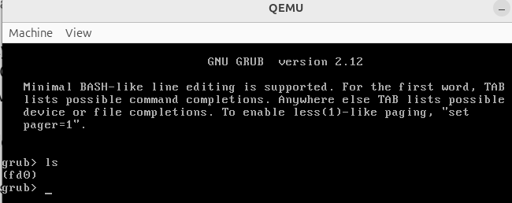

How to build Linux cpio (live) image.
## Clone
```
git clone --remote-submodules --recurse-submodules -j8 https://github.com/AndreiCherniaev/buildroot_cpio_i386_bios.git
cd buildroot_cpio_i386_bios/
```

## Make image
```
make clean -C buildroot
make BR2_EXTERNAL=$PWD/my_external_tree -C $PWD/buildroot cpio_i386_bios_defconfig
make -C buildroot
```
## Save non-default buildroot .config
To save non-default buildroot's buildroot/.config to $PWD/my_external_tree/configs/cpio_i386_bios_defconfig
```
make -C $PWD/buildroot savedefconfig BR2_DEFCONFIG=$PWD/my_external_tree/configs/cpio_i386_bios_defconfig
```
## rebuild grub2
```
make grub2-dirclean -C buildroot
make grub2-rebuild -C buildroot
make -C buildroot
```
## Clean and build Kernel
[linux-reconfigure.](https://stackoverflow.com/questions/49260466/why-when-i-change-br2-linux-kernel-custom-config-file-and-run-make-linux-reconfi)
```
make linux-menuconfig -C buildroot 
make linux-rebuild -C buildroot && make -C buildroot
```
## Save non-default Linux .config
To save non-default Linux's .config to $PWD/my_external_tree/board/my_company/my_board/pc_x86_bios_kernel_5.4.228.config
```
make -C $PWD/buildroot/ linux-update-defconfig BR2_LINUX_KERNEL_CUSTOM_CONFIG_FILE=$PWD/my_external_tree/board/my_company/my_board/pc_x86_bios_kernel_5.4.228.config
```

## Start in QEMU
```
qemu-system-i386 -m 512 -kernel ../Buildroot.img
```



# Check rootfs.cpio
Let's check what inside rootfs.cpio file. Unarchive rootfs.cpio to `archive/`
```
mkdir buildroot/output/images/archive && cd $_
cpio --no-absolute-filenames -i -vd < "../rootfs.cpio"
```
Inside `boot/` there is `grub/` only, there is no bzImage in `boot/`...
